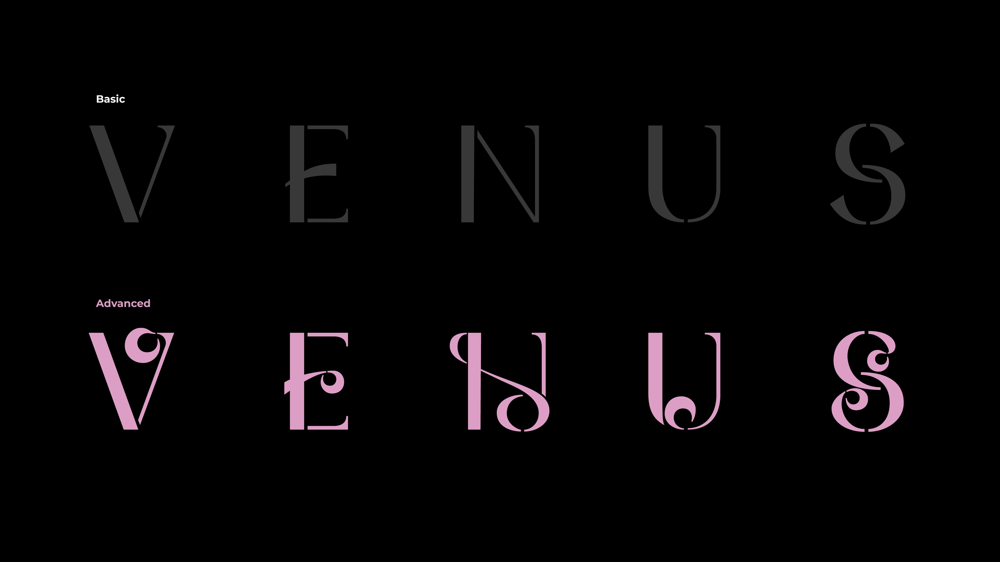
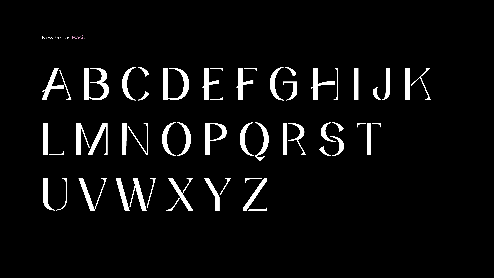
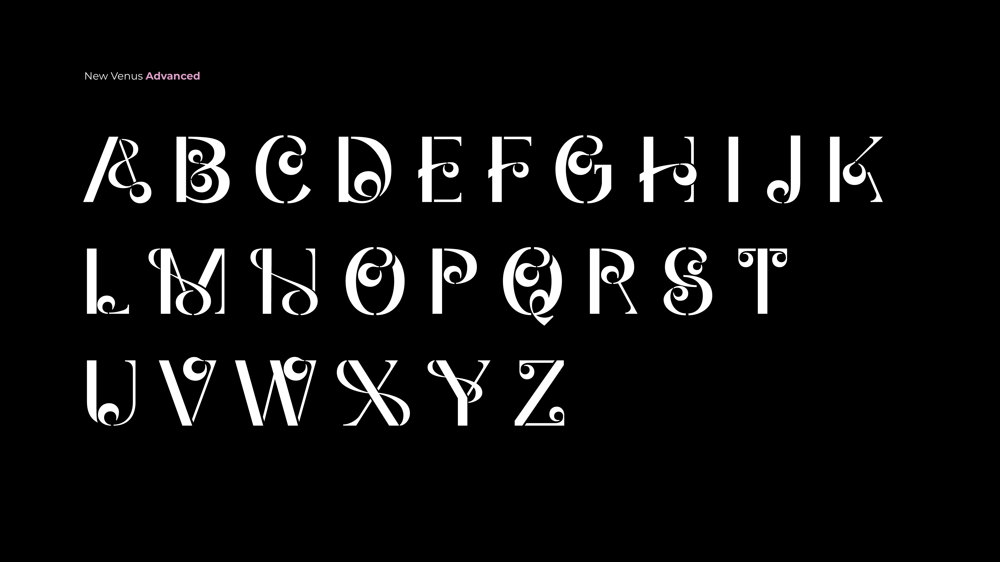
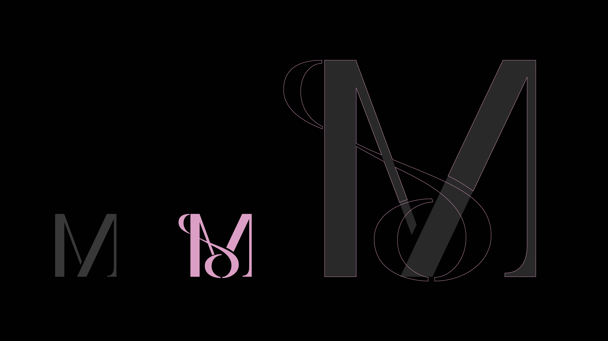
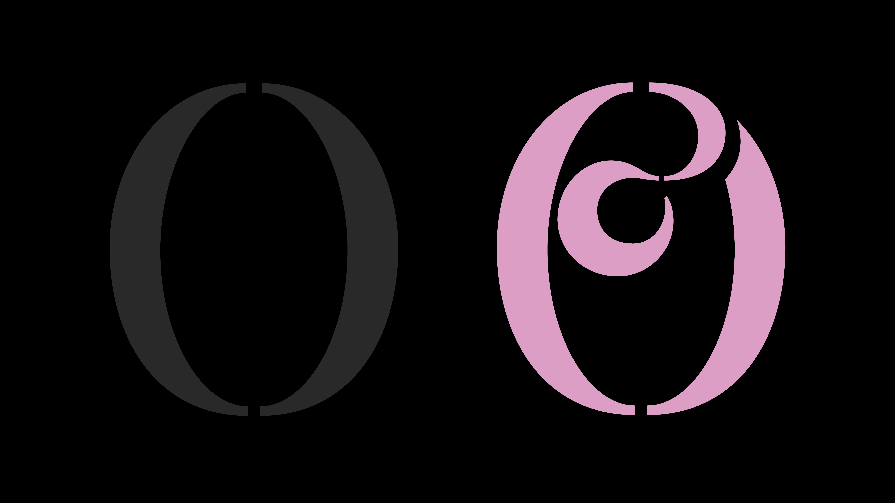
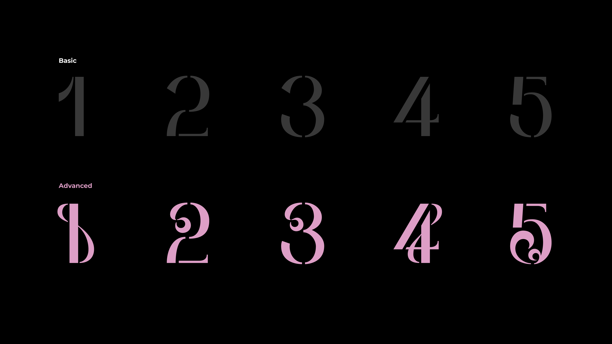
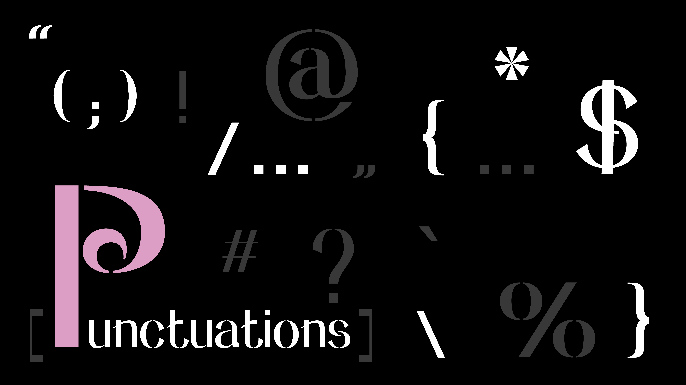

# New Venus

**New Venus** is an open-source display typeface about identity, complexity, and transformation. It is inspired by the many roles modern women inhabit — and by the strength required to carry expanding responsibilities without losing a sense of self.

One structure. Many expressions.

Designed by Evelyn Lin. Released under the [SIL Open Font License 1.1](OFL.txt).

---

## Styles

The family includes two closely related styles built on the same skeleton:

### New Venus Basic

The foundational form. Basic uses clean silhouettes, high contrast, sharp transitions, and restrained disruptions to create letterforms that feel elegant, composed, and distinct.

### New Venus Advanced

An expressive extension of Basic. Advanced preserves the same underlying structures while introducing additional curves, loops, overlaps, and visual gestures — multiple forms coexisting within each character, complexity built upon a clear and recognizable foundation.

Advanced does not replace Basic. It grows from it.

The two styles share one skeleton — Advanced is drawn directly on top of Basic:

---

## Character set

| Style | Coverage |
|---|---|
| **New Venus Basic** | Uppercase A–Z, lowercase a–z, numerals 0–9, partial punctuation |
| **New Venus Advanced** | Uppercase A–Z, numerals 0–9 |

> **Note:** This is an experimental release with an intentionally limited character set. Advanced contains no lowercase, and punctuation coverage in Basic is partial. Extended glyphs, diacritics, and full punctuation are not yet included.

---

## Intended use

New Venus was created as a distinctive contribution to the open-source type landscape. While many open-source typefaces prioritize neutrality and broad adaptability, New Venus embraces character, ornament, tension, and visual storytelling.

It is intended for designers and developers who want typography to carry meaning, not simply deliver information. Its expressive forms are best suited to display use: titles, posters, identities, editorial compositions, motion, and digital experiences — not body text.

---

## Installation

1. Download the fonts from the [`fonts/`](fonts/) folder.
2. Install the `.otf` files on your system:
   - **macOS** — double-click the file and choose *Install Font*.
   - **Windows** — right-click the file and choose *Install*.

Free to use, modify, and share under the terms of the license below.

---

## License

New Venus is licensed under the **SIL Open Font License, Version 1.1**. See [OFL.txt](OFL.txt) for the full text.

In short: you may use it freely in personal and commercial work, modify it, and redistribute it — but derivative fonts must keep the same license, may not use the reserved name "New Venus", and the font files may not be sold on their own.

---

## Author

Designed by Evelyn Lin

If you use New Venus in a project, I'd love to see it.
